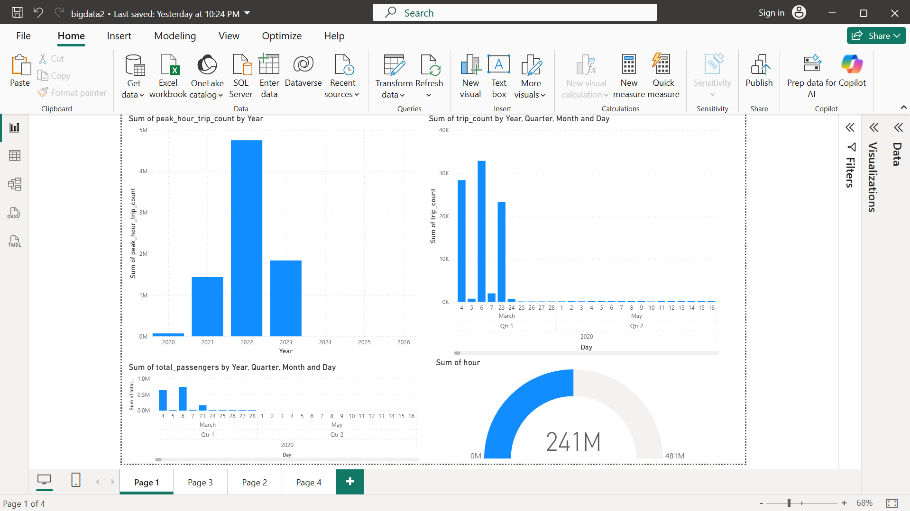
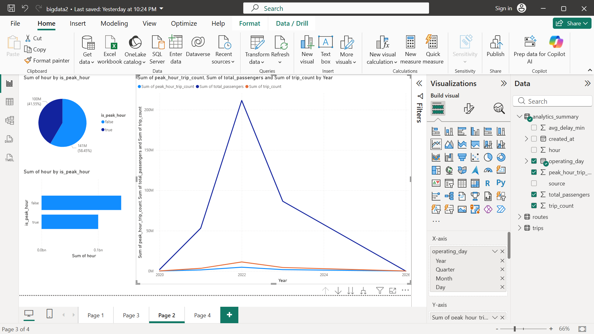
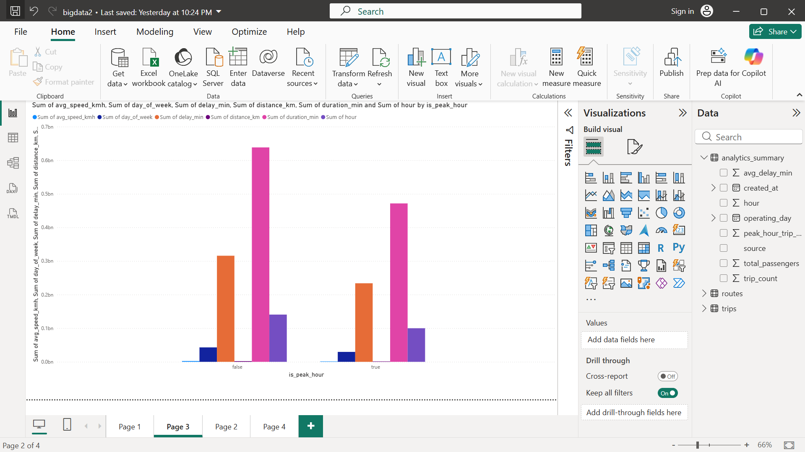

# Transport Analytics Pipeline — Smart Public Transport

An end-to-end analytics pipeline for smart public transport. The project ingests two Addis Ababa trip CSV schemas and one passenger parquet dataset, normalizes them with PySpark, loads curated tables into DuckDB, and surfaces insights in a Power BI dashboard.

## At A Glance

- Raw inputs: `data/raw/trip_data.csv`, `data/raw/final_data.csv`, and `data/raw/public_transport.parquet`
- Processing: Spark-based schema normalization, enrichment, and feature engineering
- Storage: DuckDB tables for trips, routes, and daily/hourly summaries
- Visualization: Power BI dashboard exported to `data/powerbi/`

## Dashboard Preview

The dashboard is built to explain the whole transport story, not just one chart. Each screenshot below shows a different angle of the analysis.

### 1. Trip Count and Total Passengers



This view compares how many trips ran versus how many passengers were carried. It is the best screenshot for showing demand, load, and day-to-day variation.

### 2. Peak Hours



This screenshot focuses on the busiest hours of the day. It helps show when the system is under the most pressure and when service demand is lower.

### 3. Peak vs Off-Peak Trip Analysis



This view compares peak periods with off-peak periods so the dashboard can explain traffic patterns, scheduling needs, and passenger load changes more clearly.

Together, these screenshots describe trip volume, passenger volume, peak-hour behaviour, and how demand changes across the day.

## Business Problem

Urban public transport systems generate large volumes of trip, passenger, and environmental data. This pipeline integrates GPS trip records, passenger load data, and live weather conditions to answer questions like:

- Which routes experience the most delays, and why?
- How does weather affect on-time performance?
- When are peak hours, and how does passenger load vary?

## Architecture

```
┌─────────────────────────────────────────────────────────────────┐
│                        DATA SOURCES (3)                         │
│                                                                 │
│  [CSV] Addis Ababa GPS trips   [Parquet] Kaggle passengers      │
│  data/raw/trip_data.csv        data/raw/public_transport.parquet│
│  data/raw/final_data.csv                                        │
│                    [API] OpenWeatherMap                         │
│                    (mocked fallback if no key)                  │
└──────────────────────────┬──────────────────────────────────────┘
                           │ Extract
                           ▼
┌─────────────────────────────────────────────────────────────────┐
│                    PYSPARK ETL (spark/)                         │
│                                                                 │
│  • Schema normalisation (two CSV schemas supported)             │
│  • Type casting, malformed-row drop, deduplication              │
│  • Derived features: duration_min, avg_speed_kmh, delay_min     │
│  • Weather enrichment + delay_reason (Weather / Traffic)        │
│  • Peak hour detection (75th percentile of hourly trip count)   │
│  • Unified schema: trips + routes + analytics_summary           │
└──────────────────────────┬──────────────────────────────────────┘
                           │ Write Parquet intermediates
                           ▼
┌─────────────────────────────────────────────────────────────────┐
│              PARQUET INTERMEDIATES (data/processed/)            │
│  trips_unified.parquet  routes.parquet  analytics_summary.parquet│
└──────────────────────────┬──────────────────────────────────────┘
                           │ Bulk load (atomic transaction)
                           ▼
┌─────────────────────────────────────────────────────────────────┐
│                  DUCKDB (duckdb/transport_analytics.duckdb)     │
│                                                                 │
│  Tables: trips · routes · analytics_summary                     │
│  Indexes on operating_day, route_id                             │
└──────────┬──────────────────────────────────┬───────────────────┘
           │ dbt models (bonus)               │ BI tool
           ▼                                  ▼
┌──────────────────────┐          ┌───────────────────────────────┐
│  DBT LAYER (dbt/)    │          │  POWER BI / TABLEAU DASHBOARD │
│  staging/ + marts/   │          │  (see dashboard/instructions) │
│  tests + docs        │          └───────────────────────────────┘
└──────────────────────┘

ORCHESTRATION (bonus): Airflow DAG → daily @daily schedule
```

## Repository Structure

```
data/
  raw/                        # Input datasets (provided)
    trip_data.csv             # Addis Ababa GPS trips (Schema A)
    final_data.csv            # Addis Ababa trips (Schema B)
    public_transport.parquet  # Kaggle passenger dataset
  processed/                  # Parquet outputs + weather cache (git-ignored)
etl/                          # Extract / Transform / Load modules
  config.py                   # PipelineConfig + .env loading
  extract.py                  # Source discovery + Spark readers
  transform.py                # PySpark transformations
  load.py                     # DuckDB writer
  weather.py                  # OpenWeatherMap client + mock fallback
  logging_utils.py            # Centralised logging setup
spark/
  spark_session.py            # SparkSession factory
  etl_job.py                  # Pipeline entrypoint
duckdb/
  schema.sql                  # DDL for trips, routes, analytics_summary
airflow/
  dags/pipeline_dag.py        # Airflow DAG (bonus orchestration)
dbt/
  dbt_project.yml             # dbt project config
  profiles.yml                # DuckDB connection profile
  models/
    staging/                  # stg_trips, stg_routes (views)
    marts/                    # fact_trips, dim_routes, aggregated_metrics (tables)
  models/schema.yml           # Column-level tests
dashboard/
  instructions.md             # Power BI / Tableau connection guide
scripts/
  collect_evidence.ps1        # Query DuckDB and export CSVs for submission
```

## Setup

### Prerequisites

| Tool | Version | Notes |
|------|---------|-------|
| Python | 3.11 (recommended) | On Windows, PySpark local mode may crash on Python 3.12+ |
| Java | 17+ | Required by PySpark |

### 1. Create a virtual environment

```bash
python -m venv .venv
# Windows
.venv\Scripts\activate
# macOS/Linux
source .venv/bin/activate
```

### 2. Install dependencies

```bash
pip install -r requirements.txt
```

### 3. Java (required for PySpark)

PySpark 3.5.x requires **Java 17+**. If you see `UnsupportedClassVersionError`, your Java is too old.

Install [Java 21 LTS](https://adoptium.net/) and set `JAVA_HOME`, then reopen your terminal.

The pipeline auto-detects Java under `C:\Program Files\Java\` on Windows.

### 4. OpenWeatherMap API key (optional)

The `.env` file at repo root already contains a key. If you want to use your own:

```
OPENWEATHERMAP_API_KEY=your_key_here
```

If no key is set, the pipeline uses a deterministic mock (Rain 16–20h, Clouds 7–9h, Clear otherwise).

## Running the Pipeline

### End-to-end ETL

```bash
python -m spark.etl_job
```

Outputs:
- `data/processed/trips_unified.parquet`
- `duckdb/transport_analytics.duckdb` (tables: `trips`, `routes`, `analytics_summary`)

### Collect evidence (Windows)

```powershell
.\scripts\collect_evidence.ps1
```

Requires the `duckdb` CLI on PATH. Downloads from https://duckdb.org/docs/installation/

## Bonus: Airflow Orchestration

DAG: `airflow/dags/pipeline_dag.py`
- Schedule: `@daily`
- Retries: 2 × 5-minute delay
- Execution timeout: 2 hours

Airflow is easiest to run via Docker or WSL on Windows. The Docker setup uses PostgreSQL for the Airflow metadata DB and `LocalExecutor`, which avoids the SQLite/SequentialExecutor production warnings.

For setup, deployment, and architecture details (including container dashboard, authentication, and DAG monitoring screenshots), see [airflow/README.md](airflow/README.md).

```bash
# Inside Docker / WSL with Airflow installed:
airflow dags trigger transport_analytics_pipeline
```

## Bonus: dbt Models

```bash
# Set profile directory (PowerShell)
$env:DBT_PROFILES_DIR = (Resolve-Path .\dbt).Path

# Run all models
dbt run --project-dir dbt

# Run tests
dbt test --project-dir dbt
```

Models:
- `staging/stg_trips` — view over `main.trips`
- `staging/stg_routes` — view over `main.routes`
- `marts/fact_trips` — full trip fact table
- `marts/dim_routes` — route dimension
- `marts/aggregated_metrics` — daily/hourly KPIs with weather delay counts

## Dashboard

See `dashboard/instructions.md` for Power BI / Tableau connection instructions.

Suggested pages:
1. Total passengers KPI + trend by day
2. Average delay by route / hour / weather condition
3. Peak hours — hourly trip count bar chart
4. Route performance table (trips, passengers, avg delay)
5. Peak vs off-peak analysis for trip demand and passenger load

## Transformations Implemented

- Schema normalisation across two CSV schemas and one Parquet schema
- Type casting, malformed-row drop (`DROPMALFORMED`), duplicate `trip_id` removal
- Derived features: `duration_min`, `avg_speed_kmh`, `hour`, `day_of_week`
- `delay_min` — actual vs expected (25 km/h baseline for CSV; scheduled vs actual for Parquet)
- `delay_reason` — `Weather` or `Traffic`
- `is_peak_hour` — hours above 75th percentile of hourly trip count
- Weather enrichment — bounded API lookups (max 200) cached to `data/processed/weather_cache.json`

## Team Contributions and Work Allocation

**Group 2 Members**

| Name | Primary Responsibilities |
|------|---------------------------|
| **EYOSYAS YOSEPH** | Programming work, ETL integration, Spark pipeline support, debugging, repository structure, final review, cross-team review, and overall delivery leadership |
| **HANA SHEGAWERED** | Data sourcing and initial cleaning (CSV schemas), input validation |
| **AYELE YINESU** | PySpark transformations, feature engineering, performance tuning |
| **EYERUSALEM HABTEGEBREAL** | Weather enrichment logic (OpenWeatherMap), caching + fallback behaviour |
| **BANTALEM MITIKU** | DuckDB schema design, curated table loading, query support |
| **YONAS TILAHUN** | dbt models (staging/marts), dbt tests, metrics definitions |
| **ADDISU GUCHE** | Airflow DAG/orchestration, scheduling/retries, pipeline automation |
| **EDEN SEBSBE** | Power BI dashboard build, screenshots, dashboard documentation updates |


